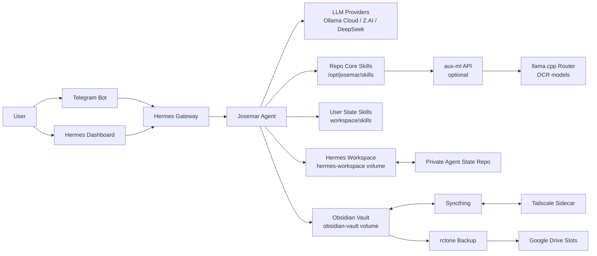
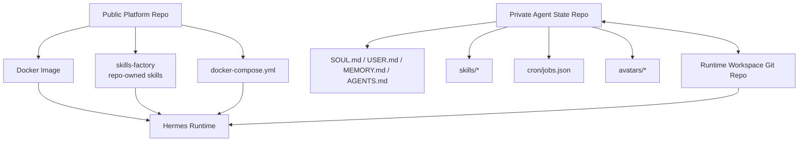
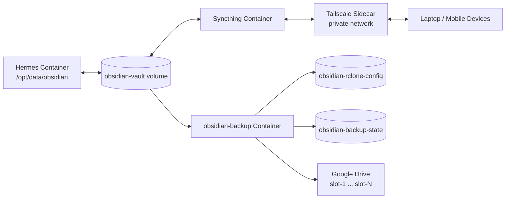
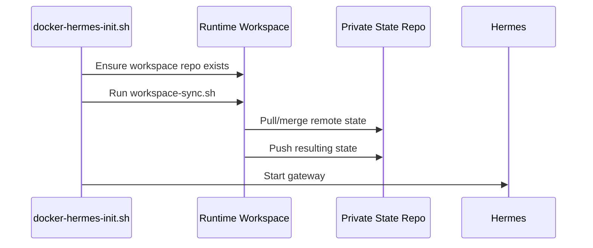

# Josemar Assistente

Self-hosted Hermes assistant infrastructure for running a private AI assistant with Telegram, dashboard/API access, git-backed agent state, an Obsidian vault, and optional queue-based local ML jobs.

This repository is the public/platform layer. Personal identity, memories, private workflows, and user-specific skills live in a separate private `agent-state` repository so this repo can evolve independently from each user's assistant state.

## What This Repo Provides

- **Hermes Agent gateway**: self-hosted runtime with dashboard and OpenAI-compatible API.
- **Telegram channel**: allowlisted Telegram DM access with a single runtime owner.
- **Independent agent state**: private git-backed workspace for context files, cron jobs, avatars, and user-owned skills.
- **Two-scope skills model**: repo-owned platform skills in `skills-factory/`, user-owned skills in `agent-state/skills/`.
- **Obsidian vault infrastructure**: dedicated Docker volume synchronized with Syncthing over a Tailscale sidecar.
- **Google Drive vault backups**: daily rotating backup slots via rclone.
- **Optional auxiliary ML service**: internal `aux-ml` container for FIFO, one-at-a-time long-running OCR jobs through llama.cpp.
- **Multi-provider LLM config**: Ollama Cloud, Z.AI/GLM, DeepSeek, and other OpenAI-compatible providers can be configured.
- **Security checks**: gitleaks and a custom PII guard in CI and optional pre-commit hooks.

Domain-specific behavior, such as Brazilian credit-card invoice extraction, belongs in a user's private state-repo skills unless it is explicitly added to `skills-factory/`. The public repo currently ships the infrastructure needed to support OCR and custom skills, not that personal extraction workflow itself.

## Architecture



## State Separation

The main repository can stay public because user-specific assistant state is isolated in a private nested repo mounted at `agent-state/`.



The workspace sync script only versions paths listed in `.sync-manifest`, uses the remote state repo as the blessed conflict winner, and can auto-commit/push state changes from the running assistant.

## Obsidian Vault Flow



The vault is not git-versioned. It persists in its own Docker volume, syncs through Syncthing, and is backed up by rotating rclone snapshots.

## Quick Start

### 1. Clone and Prepare State

```bash
git clone <this-repo-url> josemar-assistente
cd josemar-assistente
cp .env.example .env
```

Clone your private state repo into `agent-state/`:

```bash
git clone <your-private-agent-state-repo-url> agent-state
```

If you do not have a state repo yet, initialize from the template:

```bash
cp -r templates/agent-state-template/ agent-state
cd agent-state
git init
git add -A
git commit -m "Initial state"
cd ..
```

### 2. Configure `.env`

Set the required runtime variables:

```bash
TELEGRAM_BOT_TOKEN=your-telegram-token
PRIMARY_TELEGRAM_ID=123456789
WORKSPACE_STATE_REPO=https://github.com/username/private-agent-state.git
WORKSPACE_REPO_TOKEN=your-github-pat
HERMES_DASHBOARD_SESSION_TOKEN=<openssl rand -hex 32>
```

Set provider keys used by your configured model strategy:

```bash
OLLAMA_API_KEY=your-ollama-cloud-key
ZAI_API_KEY=your-zai-key
DEEPSEEK_API_KEY=your-deepseek-key
```

Optionally enable web search and extract by setting a Tavily key (auto-detected by Hermes when present):

```bash
TAVILY_API_KEY=your-tavily-api-key
```

See `.env.example` for the full variable list.

### 3. Start Locally

```bash
docker compose build
docker compose up -d
docker compose logs -f hermes
```

Access:

- Dashboard: `http://localhost:9119`
- API server (if enabled): `http://127.0.0.1:8642`

### 4. Optional Aux-ML

Enable auxiliary ML only when needed:

```bash
# In .env
AUX_ML_ENABLED=true
COMPOSE_PROFILES=aux-ml

docker compose up -d --build
```

## Repository Layout

```text
josemar-assistente/
├── agent-state/                    # Nested private git repo for assistant state
├── aux-ml/                         # Optional FastAPI + llama.cpp queue service
├── credentials/                    # Local credentials, not versioned
├── docs/                           # Operations runbooks
├── scripts/                        # Workspace sync, backup, privacy tooling
├── skills-factory/                 # Repo-owned core skills shipped in image
├── templates/agent-state-template/ # Starter private state repo template
├── tests/                          # Python unit tests
├── .github/workflows/              # Deploy, stop, runner test, privacy scan
├── docker-compose.yml              # Service topology and persistent volumes
├── Dockerfile.hermes               # Custom Hermes image
└── .env.example                    # Environment template
```

## Runtime Services and Volumes

| Service | Purpose |
| --- | --- |
| `hermes` | Main Hermes gateway, Telegram channel, dashboard/API, agent runtime. |
| `aux-ml` | Optional internal queue API for long-running OCR jobs. |
| `tailscale` | Private-network sidecar for Syncthing connectivity. |
| `syncthing` | Syncs the Obsidian vault to trusted devices. |
| `obsidian-backup` | Runs daily rclone backups into rotating Google Drive slots. |

| Volume | Purpose |
| --- | --- |
| `hermes-data` | Hermes native runtime state (config, sessions, memories, cron). |
| `hermes-workspace` | Git-synced workspace state and user-owned skills. |
| `obsidian-vault` | Obsidian notes and attachments, not git-versioned. |
| `syncthing-config` | Syncthing identity and folder/device config. |
| `tailscale-state` | Tailscale node identity and login state. |
| `obsidian-rclone-config` | rclone config used by vault backup container. |
| `obsidian-backup-state` | Rotating backup slot pointer. |

## Skills

Skills are intentionally split by ownership:

| Scope | Location | Owner | Use |
| --- | --- | --- | --- |
| Core platform skills | `skills-factory/` copied to `/opt/josemar/skills` | This repo | Stable runtime capabilities shared by all deployments. |
| User state skills | `agent-state/skills/` synced to workspace | Private state repo | Personal workflows, user-specific automations, domain-specific processors. |

Current repo-shipped skills:

- `vault-gateway`: entrypoint for vault routing and operations.
- `aux-ml`: skill interface for queue-based auxiliary ML jobs.
- `workspace-sync`: skill interface for workspace git sync, status, commit, and push flows.

## Agent State Sync



Important state-sync variables:

- `WORKSPACE_STATE_REPO`
- `WORKSPACE_REPO_TOKEN`
- `WORKSPACE_GIT_BRANCH`
- `WORKSPACE_SYNC_ON_START`
- `WORKSPACE_SYNC_INTERVAL`
- `WORKSPACE_GIT_USER_EMAIL`
- `WORKSPACE_GIT_USER_NAME`

## Development

Run unit tests:

```bash
python3 -m unittest discover -s tests -v
```

Run scoped contract tests:

```bash
python3 -m unittest tests.vault_gateway.test_gateway_contract -v
```

Set up optional pre-commit hooks:

```bash
./scripts/setup-pre-commit.sh
```

Manual privacy checks:

```bash
python3 scripts/pii_guard.py --staged --fail-on medium
```

## Credentials

Credentials go under `credentials/<service>/` and are mounted read-only into Hermes. Do not commit real credentials.

## Documentation Index

- `AGENTS.md`: root project architecture and assistant guidance.
- `credentials/README.md`: credential setup and storage rules.
- `docs/aux-ml.md`: auxiliary ML API, queue, model lifecycle, and OCR operations.
- `docs/obsidian-operations.md`: Syncthing, Tailscale, rclone backup, and restore runbook.
- `.github/workflows/AGENTS.md`: deployment, stop, privacy scan, and runner workflow documentation.
- `templates/agent-state-template/README.md`: starting point for a private state repo.

## License

MIT
