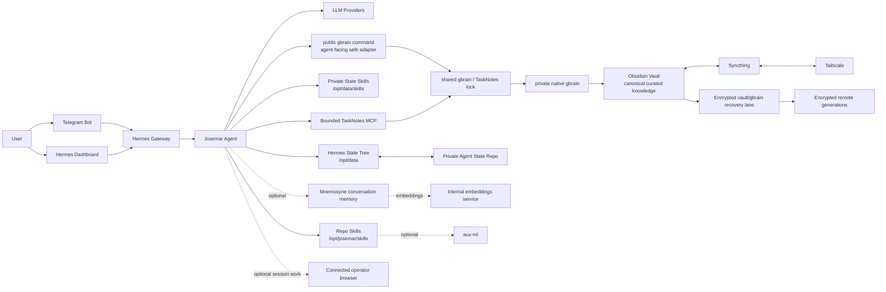
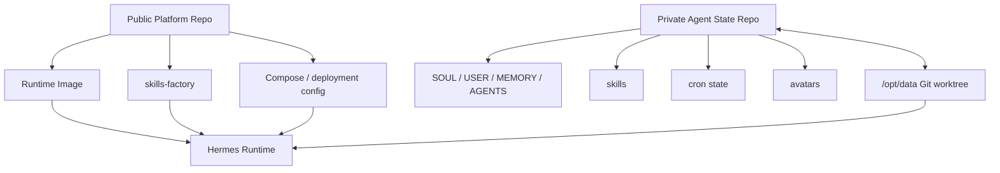

# Josemar Assistente

Self-hosted Hermes assistant infrastructure with Telegram/dashboard access, Git-backed private agent state, a curated Obsidian/gbrain knowledge vault, encrypted recovery, and optional memory/browser/ML services.

This repository is the public platform layer. User-specific identity, memories, private workflows, and user-owned skills live in a separate private `agent-state` repository.

For the documentation map and guidance on what to load for a particular subsystem/change, start with [`docs/README.md`](docs/README.md).

## What this repository provides

- **Hermes gateway runtime** with dashboard/API/Telegram integration.
- **Two-scope skills**: repo-owned platform skills in `skills-factory/` and user-owned skills in the private state repo.
- **Git-backed agent state** under `/opt/data`, synchronized only for allowlisted paths.
- **Curated Obsidian/gbrain vault** with a safe public agent-facing wrapper and shared single-writer coordination.
- **Bounded TaskNotes MCP** for task lifecycle mutations, using private native gbrain internally under the same lock.
- **Syncthing/Tailscale vault sync** for external Obsidian devices.
- **Default encrypted vault recovery** for the vault plus complete gbrain runtime state.
- **Optional Mnemosyne conversation memory** backed by an internal embeddings service.
- **Optional connected-browser overlay** for work requiring an operator-controlled authenticated browser session; ordinary server-headless browser tooling remains separate.
- **Optional aux-ml service** for bounded long-running OCR/ML jobs.
- **CI/privacy gates** including test, secret, and PII checks.

## Architecture


```mermaid
flowchart LR
  User[User] --> Telegram[Telegram Bot]
  User --> Dashboard[Hermes Dashboard]
  Telegram --> Gateway[Hermes Gateway]
  Dashboard --> Gateway

  Gateway --> Agent[Josemar Agent]
  Agent --> Models[LLM Providers]
  Agent --> CoreSkills[Repo Skills<br/>/opt/josemar/skills]
  Agent --> UserSkills[Private State Skills<br/>/opt/data/skills]

  Agent --> PublicGBrain[public gbrain command<br/>agent-facing safe adapter]
  Agent --> TaskNotes[Bounded TaskNotes MCP]
  PublicGBrain --> SharedLock[shared gbrain / TaskNotes lock]
  TaskNotes --> SharedLock
  SharedLock --> NativeGBrain[private native gbrain]
  NativeGBrain --> Vault[Obsidian Vault<br/>canonical curated knowledge]

  Vault <--> Syncthing[Syncthing]
  Syncthing <--> Tailscale[Tailscale]

  Agent --> StateTree[Hermes State Tree<br/>/opt/data]
  StateTree <--> StateRepo[Private Agent State Repo]

  Agent -. optional .-> Mnemosyne[Mnemosyne conversation memory]
  Mnemosyne -. embeddings .-> TEI[Internal embeddings service]

  CoreSkills -. optional .-> AuxML[aux-ml]
  Agent -. optional session work .-> ConnectedBrowser[Connected operator browser]

  Vault --> Recovery[Encrypted vault/gbrain recovery lane]
  Recovery --> Remote[Encrypted remote generations]
```

The public `gbrain` command is the general agent-facing vault path. TaskNotes is intentionally different: it owns task-file mutations and invokes the private native gbrain path internally while holding its transaction/shared lock. It must not route through the public wrapper. Both paths converge on the same single-writer gbrain/vault state.

Detailed gbrain/TaskNotes locking and recovery contracts live in [`docs/gbrain-operations.md`](docs/gbrain-operations.md) and [`docs/tasknotes-mcp.md`](docs/tasknotes-mcp.md).

## State separation


```mermaid
flowchart TB
  PublicRepo[Public Platform Repo] --> Image[Runtime Image]
  PublicRepo --> CoreSkills[skills-factory]
  PublicRepo --> Compose[Compose / deployment config]

  PrivateRepo[Private Agent State Repo] --> Personality[SOUL / USER / MEMORY / AGENTS]
  PrivateRepo --> UserSkills[skills]
  PrivateRepo --> Cron[cron state]
  PrivateRepo --> Avatars[avatars]

  Image --> Runtime[Hermes Runtime]
  CoreSkills --> Runtime
  Compose --> Runtime
  PrivateRepo <--> StateTree["/opt/data Git worktree"]
  StateTree --> Runtime
```

Only paths listed by the state-sync manifest are versioned automatically. The private state repository remains the source of truth for user-owned state; the public repository must not contain private-state contents, credentials, PII, or user-specific anecdotes.

## Quick start

### 1. Clone the platform repository

```bash
git clone <this-repo-url> josemar-assistente
cd josemar-assistente
cp .env.example .env
```

### 2. Prepare the private state repository

Clone an existing private state repository into `agent-state/`:

```bash
git clone <your-private-agent-state-repo-url> agent-state
```

Or initialize one from the provided template:

```bash
cp -r templates/agent-state-template/ agent-state
cd agent-state
git init
git add -A
git commit -m "Initial state"
cd ..
```

Treat `agent-state/` as private. Do not commit its contents into the public platform repository.

### 3. Configure credentials and runtime settings

- Use `.env.example` for local runtime configuration shape.
- Use [`credentials/README.md`](credentials/README.md) for credential setup.
- Use [`docs/github-workflows.md`](docs/github-workflows.md) for the canonical GitHub Actions secret/variable catalog and workflow operations.

Never commit real credentials or generated secret-bearing files.

### 4. Start locally

```bash
docker compose up -d
docker compose logs -f hermes
```

When starting a local Hermes instance for validation, explicitly disable Telegram credentials/allowlists so a development container cannot contend with the production bot deployment. See root [`AGENTS.md`](AGENTS.md) for contributor/harness rules.

Optional services use their documented Compose profiles/overlays; do not guess combinations from this README. Use the relevant runbook in [`docs/README.md`](docs/README.md).

## Core operational domains

### gbrain / Obsidian vault

The Obsidian vault is the canonical curated knowledge store. Agent-facing general note work uses the public `gbrain` command. Task lifecycle mutation uses the bounded TaskNotes MCP. External Obsidian/Syncthing edits are reconciled through the documented operator refresh path.

Semantic/hybrid gbrain retrieval is an operator-enabled capability rather than a timeless README claim about current runtime state. Use the runtime status command when current activation matters. See:

- [`skills-factory/gbrain/SKILL.md`](skills-factory/gbrain/SKILL.md) for routine runtime-agent operations;
- [`docs/gbrain-operations.md`](docs/gbrain-operations.md) for activation/reindex/embeddings/maintenance;
- [`docs/tasknotes-mcp.md`](docs/tasknotes-mcp.md) for task behavior and locking;
- [`docs/obsidian-operations.md`](docs/obsidian-operations.md) for vault sync operations.

### Encrypted vault recovery

The deployment includes the documented encrypted vault/gbrain recovery lane. Recovery/export/upload/restore ordering, validation gates, and rollback are high-risk operator procedures and intentionally live in [`docs/vault-recovery-operations.md`](docs/vault-recovery-operations.md), not this overview.

### Mnemosyne

Mnemosyne is an optional conversation-memory subsystem separate from the curated vault. The Obsidian/gbrain path remains the **canonical curated vault**; Mnemosyne is **not a vault replacement**. Its deployment modes, storage, embeddings dependency, backup/recovery, and rollback are documented in [`docs/mnemosyne-operations.md`](docs/mnemosyne-operations.md). Retrieval-quality evaluation lives in [`docs/mnemosyne-retrieval-quality.md`](docs/mnemosyne-retrieval-quality.md).

`MNEMOSYNE_DEPLOY_MODE` has three supported values:

| Value | Mnemosyne overlays / behavior | Additional backup requirements |
| --- | --- | --- |
| `off` | Mnemosyne overlays are not selected. | None for Mnemosyne. |
| `pilot` | `docker-compose.embeddings.yml` + `docker-compose.mnemosyne.yml`. | None for the Mnemosyne backup lane. |
| `backup` | Pilot overlays + `docker-compose.mnemosyne-backup.yml`. | `MNEMOSYNE_BACKUP_EXPORT_INTERVAL` must be a positive integer with no leading zeros and at most `10080` minutes; `RCLONE_CONFIG_B64` must provide the `mnemosyne-crypt` remote. The default vault-recovery lane independently requires `vault-recovery-crypt`. |

The embeddings/TEI service is internal-only with **no host port**. In `backup` mode, `mnemosyne-backup-uploader` uses the `mnemosyne-backup-staging`, `mnemosyne-backup-state`, and `mnemosyne-backup-recovery` volumes. Local staging is **not encrypted**; encryption begins at the rclone `crypt` remote, and recovery is **operator-controlled**.

### Browser control

Josemar distinguishes public search/extraction, the ordinary server-headless browser, and the optional externally connected browser used for authenticated/session-dependent work. The runtime routing contract is in [`skills-factory/browser-control/SKILL.md`](skills-factory/browser-control/SKILL.md); architecture and operator setup are in [`docs/browser-control.md`](docs/browser-control.md).

### aux-ml

The optional aux-ml service handles bounded auxiliary ML/OCR work. Architecture, configuration, and operations are in [`docs/aux-ml.md`](docs/aux-ml.md).

## Development and validation

Use the repository's named Make targets:

```bash
make test
make verify
```

Use [`tests/README.md`](tests/README.md) to select focused/unit/contract/runtime gates and the correct timeout budget. Expensive Docker/runtime gates are intentionally opt-in or workflow-controlled; do not run every gate indiscriminately.

## Documentation and coding-harness guidance

- [`AGENTS.md`](AGENTS.md) — repository-wide coding-harness rules and routing.
- [`docs/documentation-policy.md`](docs/documentation-policy.md) — canonical documentation ownership, modularity, update, and context-placement policy.
- [`docs/README.md`](docs/README.md) — documentation index with audience and **when to load** routing.
- [`.github/workflows/AGENTS.md`](.github/workflows/AGENTS.md) — workflow-specific change constraints and documentation dependencies.
- [`docs/github-workflows.md`](docs/github-workflows.md) — workflow catalog, secret/variable catalog, and operator-facing workflow summary.
- [`tests/README.md`](tests/README.md) — supported validation procedures.

A code/config/test change and its durable documentation are one change. Parent guidance is responsible for routing workers to the narrower documents that become relevant for a given class of change.

## Security and privacy

- Never commit secrets, credential values, private state, PII, or private host/network details.
- Keep the private state repository separate from this public repository.
- Keep agent-facing gbrain access on the public safe wrapper and preserve the shared single-writer locking model.
- Follow the dedicated runbooks for destructive recovery, dependency upgrades, remote browser access, or other high-risk operations.
- Run the repository privacy/secret checks before publishing relevant changes.

## Documentation map

See [`docs/README.md`](docs/README.md) for the maintained document catalog. The index identifies each document's role/audience and when coding workers/operators should load it, allowing the repository to stay complete without filling routine agent context with every runbook.
