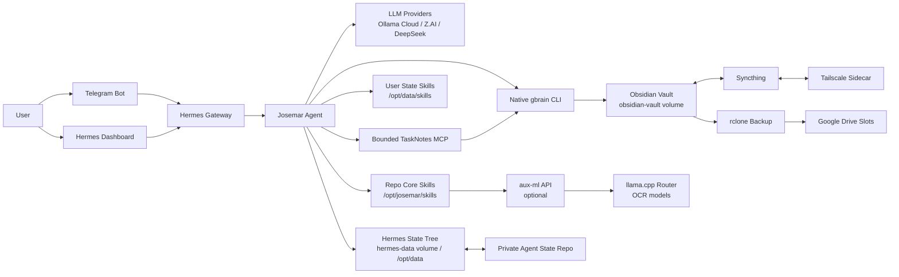
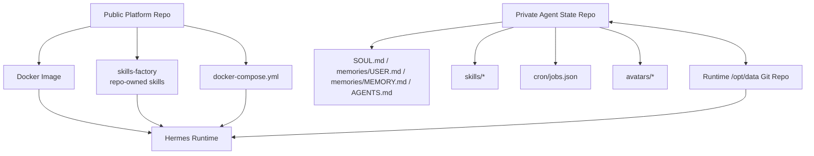
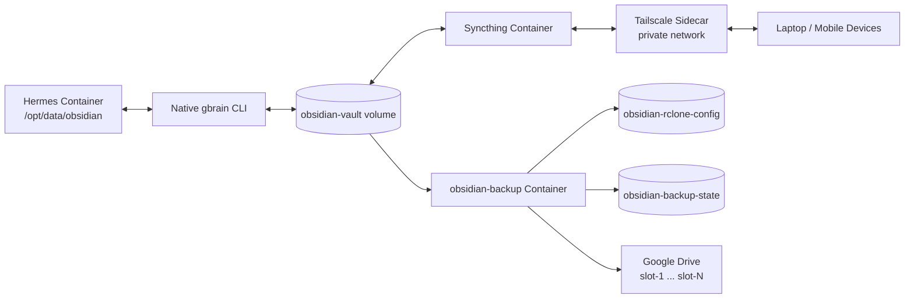
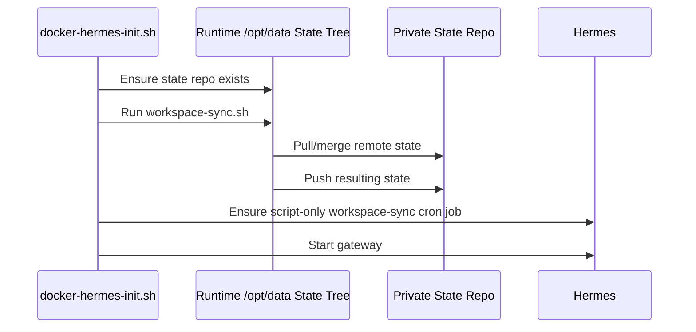

# Josemar Assistente

Self-hosted Hermes assistant infrastructure for running a private AI assistant with Telegram, dashboard/API access, git-backed agent state, an Obsidian vault, and optional queue-based local ML jobs.

This repository is the public/platform layer. Personal identity, memories, private workflows, and user-specific skills live in a separate private `agent-state` repository so this repo can evolve independently from each user's assistant state.

## What This Repo Provides

- **Hermes Agent gateway**: self-hosted runtime with dashboard and OpenAI-compatible API.
- **Telegram channel**: allowlisted Telegram DM access with a single runtime owner.
- **Independent agent state**: private git-backed Hermes state tree for context files, cron jobs, avatars, and user-owned skills.
- **Two-scope skills model**: repo-owned platform skills in `skills-factory/`, user-owned skills in `agent-state/skills/`.
- **Obsidian vault infrastructure**: dedicated Docker volume synchronized with Syncthing over a Tailscale sidecar.
- **TaskNotes lifecycle MCP**: bounded create/get/list/update/complete/archive tools backed by native gbrain, with fail-closed profile and Git transaction guards.
- **Google Drive vault backups**: daily rotating backup slots via rclone.
- **Optional auxiliary ML service**: internal `aux-ml` container for FIFO, one-at-a-time long-running OCR jobs through llama.cpp.
- **Multi-provider LLM config**: Ollama Cloud, Z.AI/GLM, DeepSeek, and other OpenAI-compatible providers can be configured.
- **Security checks**: gitleaks and a custom PII guard in CI and optional pre-commit hooks.

Domain-specific behavior, such as Brazilian credit-card invoice extraction, belongs in a user's private state-repo skills unless it is explicitly added to `skills-factory/`. The public repo currently ships the infrastructure needed to support OCR and custom skills, not that personal extraction workflow itself.

## Architecture


```mermaid
flowchart LR
  User[User] --> Telegram[Telegram Bot]
  User --> Dashboard[Hermes Dashboard]

  Telegram --> Gateway[Hermes Gateway]
  Dashboard --> Gateway

  Gateway --> Agent[Josemar Agent]
  Agent --> Models[LLM Providers<br/>Ollama Cloud / Z.AI / DeepSeek]
  Agent --> CoreSkills[Repo Core Skills<br/>/opt/josemar/skills]
  Agent --> StateSkills[User State Skills<br/>/opt/data/skills]
  Agent --> GBrain[Native gbrain CLI]
  Agent --> TaskNotes[Bounded TaskNotes MCP]
  TaskNotes --> GBrain
  GBrain --> Vault[Obsidian Vault<br/>obsidian-vault volume]

  CoreSkills --> AuxML[aux-ml API<br/>optional]
  AuxML --> Llama[llama.cpp Router<br/>OCR models]

  Agent --> StateTree[Hermes State Tree<br/>hermes-data volume / /opt/data]
  StateTree <--> StateRepo[Private Agent State Repo]
  Vault <--> Syncthing[Syncthing]
  Syncthing <--> Tailscale[Tailscale Sidecar]
  Vault --> Backup[rclone Backup]
  Backup --> GDrive[Google Drive Slots]
```

## State Separation

The main repository can stay public because user-specific assistant state is isolated in a private nested repo mounted at `agent-state/`.


```mermaid
flowchart TB
  PublicRepo[Public Platform Repo] --> Image[Docker Image]
  PublicRepo --> CoreSkills[skills-factory<br/>repo-owned skills]
  PublicRepo --> Compose[docker-compose.yml]

  PrivateRepo[Private Agent State Repo] --> Personality[SOUL.md / memories/USER.md / memories/MEMORY.md / AGENTS.md]
  PrivateRepo --> UserSkills[skills/*]
  PrivateRepo --> Cron[cron/jobs.json]
  PrivateRepo --> Avatars[avatars/*]

  Image --> Runtime[Hermes Runtime]
  CoreSkills --> Runtime
  Compose --> Runtime
  PrivateRepo <--> StateTree[Runtime /opt/data Git Repo]
  StateTree --> Runtime
```

The state sync script only versions paths listed in `.sync-manifest`, uses the remote state repo as the blessed conflict winner, and can auto-commit/push state changes from the running assistant.

## Obsidian Vault Flow


```mermaid
flowchart LR
  Hermes[Hermes Container<br/>/opt/data/obsidian] <--> GBrain[Native gbrain CLI]
  GBrain <--> Vault[(obsidian-vault volume)]
  Vault <--> Syncthing[Syncthing Container]
  Syncthing <--> Tailscale[Tailscale Sidecar<br/>private network]
  Tailscale <--> Devices[Laptop / Mobile Devices]
  Vault --> Backup[obsidian-backup Container]
  Backup --> RcloneConfig[(obsidian-rclone-config)]
  Backup --> SlotState[(obsidian-backup-state)]
  Backup --> Drive[Google Drive<br/>slot-1 ... slot-N]
```

The vault persists in its own Docker volume, syncs through Syncthing, and is backed up by rotating rclone snapshots. Native gbrain sync already uses local-only Git history; the TaskNotes MCP reuses it for safe automatic commits. The repository has no remote consumer, its `.git/` directory must be excluded from Syncthing, and it is separate from agent-state versioning.

## Quick Start

### 1. Clone and Prepare State

```bash
git clone <this-repo-url> josemar-assistente
cd josemar-assistente
cp .env.example .env
```

Clone your private state repo into `agent-state/`:

```bash
git clone <your-private-agent-state-repo-url> agent-state
```

If you do not have a state repo yet, initialize from the template:

```bash
cp -r templates/agent-state-template/ agent-state
cd agent-state
git init
git add -A
git commit -m "Initial state"
cd ..
```

### 2. Configure `.env`

Set the required runtime variables:

```bash
TELEGRAM_BOT_TOKEN=your-telegram-token
PRIMARY_TELEGRAM_ID=123456789
WORKSPACE_STATE_REPO=https://github.com/username/private-agent-state.git
WORKSPACE_REPO_TOKEN=your-github-pat
HERMES_DASHBOARD_SESSION_TOKEN=<openssl rand -hex 32>
HERMES_DASHBOARD_BASIC_AUTH_USERNAME=admin
HERMES_DASHBOARD_BASIC_AUTH_PASSWORD=<openssl rand -hex 24>
HERMES_DASHBOARD_BASIC_AUTH_SECRET=<openssl rand -hex 32>
```

Use a username other than `admin` if this dashboard is reachable through any
remote access path.

Set provider keys used by your configured model strategy:

```bash
DEEPSEEK_API_KEY=your-deepseek-key
ZAI_API_KEY=your-zai-key
OLLAMA_API_KEY=your-ollama-cloud-key
```

Optionally enable web search and extract by setting a Tavily key (auto-detected by Hermes when present):

```bash
TAVILY_API_KEY=your-tavily-api-key
```

See `.env.example` for the full variable list.

### 3. Start Locally

```bash
docker compose build
docker compose up -d
docker compose logs -f hermes
```

Access:

- Dashboard: `http://localhost:9119` with Basic Auth
- API server (if enabled): `http://127.0.0.1:8642`

The dashboard host port binds to `127.0.0.1` by default. If publishing it through
Cloudflare Tunnel, keep the tunnel origin pointed at `http://localhost:9119`.
Cloudflare Access can be added as defense-in-depth after verifying Hermes
Desktop compatibility with the extra access layer.

If the Cloudflare tunnel runs on a different host and must reach the Docker VM
over the LAN, set `HERMES_DASHBOARD_BIND_IP` to the VM LAN address instead of
`127.0.0.1`. Do not use `0.0.0.0`.

### 4. Optional Aux-ML

Enable auxiliary ML only when needed:

```bash
# In .env
AUX_ML_ENABLED=true
COMPOSE_PROFILES=aux-ml

docker compose up -d --build
```

## Repository Layout

```text
josemar-assistente/
├── agent-state/                    # Nested private git repo for assistant state
├── aux-ml/                         # Optional FastAPI + llama.cpp queue service
├── browser-tunnel/                 # Optional hardened OpenSSH reverse-tunnel sidecar image
├── credentials/                    # Local credentials, not versioned
├── docs/                           # Operations runbooks
├── laptop/linux/                   # Optional on-demand Linux laptop launcher (Mint-tested)
├── scripts/                        # Workspace sync, backup, privacy tooling
├── skills-factory/                 # Repo-owned core skills shipped in image
├── templates/agent-state-template/ # Starter private state repo template
├── tests/                          # Python unit tests
├── .github/workflows/              # Deploy, stop, runner test, privacy scan
├── docker-compose.yml              # Service topology and persistent volumes
├── docker-compose.browser-control.yml # Optional browser-control overlay
├── Dockerfile.hermes               # Custom Hermes image
└── .env.example                    # Environment template
```

## Runtime Services and Volumes

| Service | Purpose |
| --- | --- |
| `hermes` | Main Hermes gateway, Telegram channel, dashboard/API, agent runtime. |
| `aux-ml` | Optional internal queue API for long-running OCR jobs. |
| `tailscale` | Private-network sidecar for Syncthing connectivity and (optionally) Tailscale Serve for browser control. |
| `syncthing` | Syncs the Obsidian vault to trusted devices. |
| `obsidian-backup` | Runs daily rclone backups into rotating Google Drive slots. |
| `browser-tunnel` | Optional hardened OpenSSH reverse-tunnel sidecar for remote browser control. Only started under the `browser-control` Compose overlay/profile. See `docs/browser-control.md`. |

| Volume | Purpose |
| --- | --- |
| `hermes-data` | Hermes runtime state and the private state git worktree at `/opt/data`. Includes gbrain state at `/opt/data/.gbrain` (PGLite database, config, cache). Runtime-private files are ignored by the state repo. |
| `aux-ml-shared` | Dedicated handoff volume for files intentionally shared with aux-ml. |
| `obsidian-vault` | Obsidian notes and attachments plus local-only Git history required by native gbrain sync. The history has no remote consumer and `.git/` is excluded from Syncthing. |
| `syncthing-config` | Syncthing identity and folder/device config. |
| `tailscale-state` | Tailscale node identity and login state. |
| `obsidian-rclone-config` | rclone config used by vault backup container. |
| `obsidian-backup-state` | Rotating backup slot pointer. |
| `browser-tunnel-state` | Persistent Ed25519 SSH host key for the optional `browser-tunnel` sidecar so laptop `known_hosts` stays stable across redeploys. |

## Skills

Skills are intentionally split by ownership:

| Scope | Location | Owner | Use |
| --- | --- | --- | --- |
| Core platform skills | `skills-factory/` copied to `/opt/josemar/skills` | This repo | Stable runtime capabilities shared by all deployments. |
| User state skills | `agent-state/skills/` synced to `/opt/data/skills` | Private state repo | Personal workflows, user-specific automations, domain-specific processors. |

Hermes discovers both scopes through `config/hermes-config.yaml` (`skills.external_dirs`).
Runtime-created user skills should be written under `/opt/data/skills/<skill>/` with a
`SKILL.md`; `workspace-sync` auto-registers those files in `.sync-manifest` so the
private state repo versions them on the next sync.

### Skill toggles and creation policy

Josemar pins Hermes so that skill enable/disable toggles and the skill-creation
policy are backed by git-tracked state instead of the noisy, sensitive
`/opt/data/config.yaml` (which is deliberately untracked).

- **Automatic skill patching/creation is disabled.** `config/hermes-config.yaml`
  sets `skills.creation_nudge_interval: 0` (no creation nudges),
  `skills.write_approval: true` (skill writes require approval), and
  `curator.enabled: false` (no background skill curator). The user-owned
  `creating-skills` skill is retained so manual/user-approved creation remains
  possible. Memory nudge is untouched.
- **Native dashboard/CLI toggles survive redeploys.** The Hermes dashboard
  `PUT /api/skills/toggle` and the `hermes skills` CLI flow through a Josemar
  helper (`scripts/josemar_skill_state.py`, copied into the image at
  `/opt/hermes/hermes_cli/josemar_skill_state.py`) that atomically writes a
  canonical JSON sidecar first and then invokes native `save_config` under one
  advisory lock. A state write failure fails the dashboard/CLI save rather than
  silently diverging.
- **Per-profile sidecar paths.** Only the dedicated toggle JSON is versioned,
  never the full config:
  - Default (base `HERMES_HOME`) -> `hermes/skill-toggles/default.json`
  - Named profile `<canonical>` -> `hermes/skill-toggles/profiles/<canonical>.json`
  - Other `HERMES_HOME` paths are rejected. Sidecar schema is exactly
    `{"version":1,"disabled":[...],"platform_disabled":{"<platform>":[...]}}`,
    one line, sorted/deduped string lists, explicit empty arrays retained, and
    arbitrary platform keys allowed.
- **Persistence timing.** A dashboard/CLI toggle writes the local sidecar
  immediately; remote durability happens at the next periodic workspace sync
  (no Git/network inside dashboard requests). The periodic
  `hermes-workspace-sync-cron.sh` delegates to the helper's
  `sync-and-apply` operation so one advisory lock covers git sync, remote
  merge, and the sidecar/policy apply — dashboard writes and sync never race.
- **Remote-wins conflicts.** Workspace sync uses remote-wins merge resolution,
  so a conflicting remote sidecar overwrites a local one on merge. This is
  intentional for a single-user state repo.
- **Redeploy restoration.** On startup, `docker-hermes-init.sh` migrates
  existing toggle keys into absent sidecars (only when the keys exist and only
  for absent sidecars, so a pre-feature deployment's toggles survive the
  upgrade and an empty `default.json` is not created for a feature-less
  config), overwrites the runtime config from the repo template, runs
  workspace clone/sync/seed, and then applies the sidecars back to the
  default/named configs while enforcing the policy keys and preserving
  unrelated config. Malformed sidecars surface clearly and never modify config.
- **Session reset.** Toggling a skill does not reset an already-built prompt
  for the current session; the change takes effect on the next session/prompt
  build. Run `hermes setup` or start a new session to pick up the new toggle
  state immediately.
- **Why full config stays untracked.** `config.yaml` contains secrets,
  host-specific paths, and Hermes schema defaults that change across versions.
  Tracking it would leak secrets and create noisy diffs. The narrow sidecars
  contain only toggle state, so they are safe to version and survive
  redeploys without dragging unrelated config along.

Current repo-shipped skills:

- `gbrain`: native gbrain vault interface (search, get, capture, put, link, backlinks) used directly via the pinned `gbrain` CLI. Keyword-only search, no embeddings. Operator activation via `josemar-gbrain reindex`; periodic manual-edit reconciliation via `josemar-gbrain refresh` every 5 minutes by default.
- `tasknotes`: bounded durable-task lifecycle through the `task_*` MCP tools. Native gbrain remains the backend and sole task writer. See `docs/tasknotes-mcp.md` for prerequisites and recovery.
- `aux-ml`: skill interface for queue-based auxiliary ML jobs.
- `workspace-sync`: skill interface for workspace git sync, status, commit, and push flows.

## Agent State Sync


```mermaid
sequenceDiagram
  participant Init as docker-hermes-init.sh
  participant StateTree as Runtime /opt/data State Tree
  participant Remote as Private State Repo
  participant Hermes as Hermes

  Init->>StateTree: Ensure state repo exists
  Init->>StateTree: Run workspace-sync.sh
  StateTree->>Remote: Pull/merge remote state
  StateTree->>Remote: Push resulting state
  Init->>Hermes: Ensure script-only workspace-sync cron job
  Init->>Hermes: Start gateway
```

Important state-sync variables:

- `WORKSPACE_STATE_REPO`
- `WORKSPACE_REPO_TOKEN`
- `WORKSPACE_GIT_BRANCH`
- `WORKSPACE_SYNC_ON_START`
- `WORKSPACE_SYNC_INTERVAL` - Hermes script-only cron interval in minutes; set `0` to disable periodic sync.
- `WORKSPACE_GIT_USER_EMAIL`
- `WORKSPACE_GIT_USER_NAME`

## Development

Run unit tests:

```bash
python3 -m unittest discover -s tests -v
```

Run scoped contract tests:

```bash
python3 -m unittest tests.gbrain.test_gbrain_wrapper_contract -v
```

Set up optional pre-commit hooks:

```bash
./scripts/setup-pre-commit.sh
```

Manual privacy checks:

```bash
python3 scripts/pii_guard.py --staged --fail-on medium
```

## Credentials

Credentials go under `credentials/<service>/` and are mounted read-only into Hermes. Do not commit real credentials.

## Documentation Index

- `AGENTS.md`: root project architecture and assistant guidance.
- `credentials/README.md`: credential setup and storage rules.
- `docs/aux-ml.md`: auxiliary ML API, queue, model lifecycle, and OCR operations.
- `docs/obsidian-operations.md`: Syncthing, Tailscale, rclone backup, and restore runbook.
- `docs/gbrain-operations.md`: gbrain activation, reindex, vault swap, schema pack workflow, and troubleshooting.
- `docs/tasknotes-mcp.md`: TaskNotes profile gate, local Git/Syncthing prerequisites, tool outcomes, locking, and recovery.
- `docs/browser-control.md`: optional remote browser control via a reverse SSH tunnel over Tailscale.
- `.github/workflows/AGENTS.md`: deployment, stop, privacy scan, and runner workflow documentation.
- `templates/agent-state-template/README.md`: starting point for a private state repo.

## License

MIT
