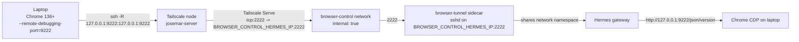

# Remote Browser Control

Optional Compose overlay that lets a laptop expose its local Chrome DevTools
Protocol (CDP) endpoint to the Josemar Hermes gateway over a reverse SSH
tunnel, so Hermes can drive the laptop's Chrome as a remote browser client.
Disabled by default; enabling it does not change Syncthing, the Obsidian vault,
Tailscale node identity, or any existing service.

> The Desktop app on the laptop is only a **remote client**. The server-side
> gateway opens CDP inside the Hermes container's network namespace; nothing
> is published to the host, the LAN, or the public internet.

## Threat model

- **Goal**: let Hermes reach a single, explicitly authorized Chrome instance on
  the operator's laptop, without exposing CDP to anything else.
- **Trusted principals**: the Josemar operator (laptop) and the Josemar server
  (Hermes + Tailscale node).
- **What is exposed**: a single TCP forward `tcp:2222` on the existing
  Tailscale node, forwarding to the `browser-tunnel` SSH daemon. The SSH daemon
  accepts only public-key auth (`AuthenticationMethods publickey`) and only
  creates a reverse listener at `127.0.0.1:9222` inside the shared Hermes
  namespace.
- **What is NOT exposed**: CDP is never bound to `0.0.0.0`, never published as a
  host port, never served via Tailscale Funnel, and never reachable from the
  LAN or the public internet. The `browser-control` Docker network is
  `internal: true` and carries only Hermes and Tailscale.
- **What the laptop supplies**: a single SSH public key (the operator's). The
  entrypoint prefixes restrictive `authorized_keys` options so a supplied plain
  public key cannot gain a shell, cannot do local/dynamic/stream forwarding,
  cannot forward agents, cannot request a TTY, and can only create the
  intended `127.0.0.1:9222` listener. `MaxSessions 0` denies shell/command/
  subsystem session channels while `ssh -N` remote forwarding remains possible.
- **What the server persists**: an Ed25519 SSH host key in the
  `browser-tunnel-state` volume so the laptop's `known_hosts` entry stays stable
  across redeploys. The authorized keys and Tailscale Serve config live in
  dedicated named volumes (`browser-tunnel-authorized-keys` and
  `tailscale-serve-config`) populated by the deploy workflow; no checkout bind
  mounts are used. No credentials are stored in the host-key volume.
- **Out of scope**: multi-user browser control, browser control without
  Tailscale, exposing CDP to other tailnet hosts, or running Chrome on the
  server. None of these are supported.

## Architecture and data flow



Key points:

- The `browser-tunnel` sidecar uses `network_mode: service:hermes`, so it
  shares Hermes's network namespace. The reverse listener the laptop creates
  (`127.0.0.1:9222`) lives in that shared namespace, so Hermes reaches Chrome
  CDP at `http://127.0.0.1:9222`.
- The SSH daemon binds only to `BROWSER_CONTROL_HERMES_IP` (default
  `172.31.250.2`) on the `browser-control` network — not `josemar-network`,
  not the tailnet, not `0.0.0.0`.
- Tailscale Serve forwards `tcp:2222` on the existing Tailscale node to
  `BROWSER_CONTROL_HERMES_IP:2222` (an explicit IP, not a Docker DNS alias).
  No Funnel, no host port publication.
- `config/hermes-config.yaml` sets `browser.cdp_url: "http://127.0.0.1:9222"`.
  No custom skill, no Playwright/Chrome install, no Hermes source patch.
- SSH user (`tunnel`), SSH port (`2222`), and CDP port (`9222`) are fixed
  constants and not configurable.

## True optionality (overlay lifecycle)

Browser control lives in a committed overlay file,
`docker-compose.browser-control.yml`, applied **only** when enabled:

- **Disabled (default)**: base `docker-compose.yml` alone. No `browser-control`
  network, no `browser-tunnel` service, no browser-specific Hermes/Tailscale
  network attachments. The base file keeps the always-present
  `tailscale-serve-config` named volume and `TS_SERVE_CONFIG` env so a disabled
  redeploy writes `{}` into `serve.json` and deterministically clears any stale
  `tcp:2222` forward from a previous enabled deploy.
- **Enabled**: the deploy workflow sets
  `COMPOSE_FILE=docker-compose.yml:docker-compose.browser-control.yml` and adds
  `browser-control` to `COMPOSE_PROFILES` (preserving `aux-ml` if enabled).
- **Disabling after enabling**: the deploy workflow always tears down with
  base + overlay + `browser-control` profile before applying the selected
  config, so a previously-enabled `browser-tunnel` sidecar and the
  `browser-control` network are removed even when the new deploy is disabling
  the overlay.

## Prerequisites

- The existing Josemar Tailscale node is up and the laptop is a member of the
  same tailnet.
- The operator has a GitHub secret `BROWSER_TUNNEL_AUTHORIZED_KEY` containing
  a single-line SSH public key (see below).
- Chrome 136 or newer on the laptop (CDP `--remote-debugging-port` behavior is
  stable on recent versions).

## Laptop setup

These are commands only. Do not run anything that installs software on the
laptop without your explicit approval; this runbook assumes Chrome and an SSH
client are already present.

### 1. Generate an SSH keypair (if you do not have one)

macOS / Linux / Windows (PowerShell or Git Bash):

```bash
ssh-keygen -t ed25519 -f ~/.ssh/josemar_browser_tunnel -N ""
```

This produces `~/.ssh/josemar_browser_tunnel` (private, keep secret on the
laptop) and `~/.ssh/josemar_browser_tunnel.pub` (public, upload as the GitHub
secret).

### 2. Add the public key as the `BROWSER_TUNNEL_AUTHORIZED_KEY` secret

Copy the single-line contents of `josemar_browser_tunnel.pub` and set it as the
`BROWSER_TUNNEL_AUTHORIZED_KEY` repository secret in GitHub
(Settings > Secrets and variables > Actions). It must be a single line in
OpenSSH format, e.g.:

```
ssh-ed25519 AAAAC3NzaC1lZDI1NTE5AAAAI... your-email@example.com
```

### 3. Grant the laptop access to tcp:2222 on the server (Tailscale ACL)

In the Tailscale admin console (ACLs), allow the laptop to reach the server's
`tcp:2222`. Use an explicit tag or host alias for both `src` and `dst`; broad
allow rules (e.g. `src: ["*"]`) defeat the narrowing and are not recommended.

Example ACL grant using a laptop tag and the server's tailnet IP/alias:

```json
{
  "action": "accept",
  "src":    ["tag:laptop"],
  "dst":    ["josemar-server:2222"]
}
```

Replace `tag:laptop` with your laptop's tag (or a specific user) and
`josemar-server` with the Tailscale node name set by `TAILSCALE_HOSTNAME`
(default `josemar-server`). Do not use a wildcard `src`.

### 4. Start Chrome with a dedicated, non-default persistent profile

> **Dedicated logins warning**: use a dedicated Chrome profile for this tunnel.
> Do NOT use your normal, day-to-day Chrome profile. A remote automation agent
> with CDP access can read/act on everything in that profile, including
> logged-in sessions. Create a fresh profile used only for Josemar browser
> control.

Chrome 136+ is required. Start Chrome with a dedicated user-data-dir and remote
debugging on `127.0.0.1:9222`:

macOS:

```bash
"/Applications/Google Chrome.app/Contents/MacOS/Google Chrome" \
  --user-data-dir="$HOME/.josemar-chrome-profile" \
  --remote-debugging-port=9222 \
  --remote-debugging-address=127.0.0.1
```

Linux:

```bash
google-chrome \
  --user-data-dir="$HOME/.josemar-chrome-profile" \
  --remote-debugging-port=9222 \
  --remote-debugging-address=127.0.0.1
```

Windows (PowerShell):

```powershell
& "C:\Program Files\Google\Chrome\Application\chrome.exe" `
  --user-data-dir="$env:USERPROFILE\.josemar-chrome-profile" `
  --remote-debugging-port=9222 `
  --remote-debugging-address=127.0.0.1
```

The normal Chrome profile is **not supported**. Always pass a dedicated
`--user-data-dir`.

### 5. Verify CDP is up locally on the laptop

```bash
curl -s http://127.0.0.1:9222/json/version
```

You should see JSON with `Browser: Chrome/...` and `webSocketDebuggerUrl`.

### 6. Open the reverse SSH tunnel

Replace `josemar-server` with your Tailscale node name and keep the keepalive
flags so idle tunnels do not drop:

```bash
ssh -N \
  -i ~/.ssh/josemar_browser_tunnel \
  -o IdentitiesOnly=yes \
  -o ServerAliveInterval=30 \
  -o ServerAliveCountMax=3 \
  -o ExitOnForwardFailure=yes \
  -R 127.0.0.1:9222:127.0.0.1:9222 \
  -p 2222 tunnel@josemar-server
```

`ExitOnForwardFailure=yes` makes ssh exit if the reverse listener could not be
created (e.g. another laptop already has the tunnel open). The laptop's
`127.0.0.1:9222` is forwarded to `127.0.0.1:9222` inside the Hermes namespace.

### 7. Keep the tunnel alive after server redeploys

The server's `browser-tunnel` sidecar restarts automatically, but the laptop's
SSH client will drop when the sidecar restarts. Use one of the native
supervisors below to reconnect automatically. Do not install `autossh`; the
examples use only the OS's built-in supervisor and the `ssh` client already on
the laptop.

#### Linux (systemd user unit)

Save as `~/.config/systemd/user/josemar-browser-tunnel.service`:

```ini
[Unit]
Description=Josemar browser control reverse SSH tunnel
After=network-online.target

[Service]
ExecStart=/usr/bin/ssh -N \
  -i %h/.ssh/josemar_browser_tunnel \
  -o IdentitiesOnly=yes \
  -o ServerAliveInterval=30 \
  -o ServerAliveCountMax=3 \
  -o ExitOnForwardFailure=yes \
  -R 127.0.0.1:9222:127.0.0.1:9222 \
  -p 2222 tunnel@josemar-server
Restart=always
RestartSec=5

[Install]
WantedBy=default.target
```

Enable and start:

```bash
systemctl --user daemon-reload
systemctl --user enable --now josemar-browser-tunnel.service
```

#### macOS (launchd)

Save as `~/Library/LaunchAgents/local.josemar.browser-tunnel.plist`:

```xml
<?xml version="1.0" encoding="UTF-8"?>
<!DOCTYPE plist PUBLIC "-//Apple//DTD PLIST 1.0//EN" "http://www.apple.com/DTDs/PropertyList-1.0.dtd">
<plist version="1.0">
<dict>
  <key>Label</key>
  <string>local.josemar.browser-tunnel</string>
  <key>ProgramArguments</key>
  <array>
    <string>/usr/bin/ssh</string>
    <string>-N</string>
    <string>-i</string>
    <string>/Users/YOURUSER/.ssh/josemar_browser_tunnel</string>
    <string>-o</string><string>IdentitiesOnly=yes</string>
    <string>-o</string><string>ServerAliveInterval=30</string>
    <string>-o</string><string>ServerAliveCountMax=3</string>
    <string>-o</string><string>ExitOnForwardFailure=yes</string>
    <string>-R</string><string>127.0.0.1:9222:127.0.0.1:9222</string>
    <string>-p</string><string>2222</string>
    <string>tunnel@josemar-server</string>
  </array>
  <key>KeepAlive</key><true/>
  <key>RunAtLoad</key><true/>
</dict>
</plist>
```

Load:

```bash
launchctl load ~/Library/LaunchAgents/local.josemar.browser-tunnel.plist
```

#### Windows (Task Scheduler)

Create a task that runs at logon with the action:

```powershell
ssh -N `
  -i $env:USERPROFILE\.ssh\josemar_browser_tunnel `
  -o IdentitiesOnly=yes `
  -o ServerAliveInterval=30 `
  -o ServerAliveCountMax=3 `
  -o ExitOnForwardFailure=yes `
  -R 127.0.0.1:9222:127.0.0.1:9222 `
  -p 2222 tunnel@josemar-server
```

In Task Scheduler, set "Start the task at logon" and "Restart the task every
5 minutes if it fails" under Settings. This does not require installing
autossh.

## Enablement (GitHub variables)

Set these GitHub repository variables (Settings > Secrets and variables >
Actions > Variables):

| Variable | Default | Notes |
| --- | --- | --- |
| `BROWSER_CONTROL_ENABLED` | `false` | Set to `true` to enable. |
| `BROWSER_CONTROL_SUBNET` | `172.31.250.0/29` | Override only on collision. |
| `BROWSER_CONTROL_GATEWAY` | `172.31.250.1` | Override together with subnet. |
| `BROWSER_CONTROL_HERMES_IP` | `172.31.250.2` | SSH daemon bind IP; Tailscale Serve forwards here. |
| `BROWSER_CONTROL_TAILSCALE_IP` | `172.31.250.3` | Tailscale's IP on browser-control. |

SSH user (`tunnel`), SSH port (`2222`), and CDP port (`9222`) are fixed
constants and not configurable.

And the secret:

| Secret | Notes |
| --- | --- |
| `BROWSER_TUNNEL_AUTHORIZED_KEY` | Single-line SSH public key. Required when enabled. |

Run the deploy workflow. It will:

- Populate the `tailscale-serve-config` named volume with
  `{"TCP":{"2222":{"TCPForward":"<BROWSER_CONTROL_HERMES_IP>:2222"}}}` when
  enabled, or `{}` when disabled (so stale tcp:2222 is cleared).
- Populate the `browser-tunnel-authorized-keys` named volume with the
  operator's public key when enabled, or clear it when disabled.
- Set `COMPOSE_FILE=docker-compose.yml:docker-compose.browser-control.yml`
  and add `browser-control` to `COMPOSE_PROFILES` when enabled; base Compose
  only when disabled.
- Always tear down with base + overlay + profile first, so a previously-enabled
  overlay is removed when disabling.
- Verify the `browser-tunnel` sidecar is running and Tailscale Serve tcp:2222
  targets the exact Hermes IP with no Funnel (it does not require the
  laptop/Chrome to be online).
- Never delete the persistent named volumes during cleanup.

## Verification

On the server:

```bash
# Sidecar is running (only when enabled)
docker compose ps browser-tunnel

# Tailscale Serve is forwarding tcp:2222 to the exact Hermes IP
docker compose exec -T tailscale tailscale serve status --json | grep 2222
```

From the laptop, after opening the reverse tunnel:

```bash
# CDP reachable through the tunnel (run on the laptop)
curl -s http://127.0.0.1:9222/json/version
```

Inside Hermes (server-side), CDP is reachable at the configured URL:

```bash
docker compose exec -T hermes curl -s http://127.0.0.1:9222/json/version
```

This only works while the laptop's reverse tunnel is up.

## Recovery and restarts

- The `browser-tunnel` sidecar has `restart: unless-stopped`. If it restarts,
  the persistent Ed25519 host key in `browser-tunnel-state` is reused, so the
  laptop's `known_hosts` entry stays valid.
- If the laptop's tunnel drops, the native supervisor (systemd/launchd/Task
  Scheduler) reconnects automatically. Only one laptop can hold the
  `127.0.0.1:9222` listener at a time; a second connection fails fast with
  `ExitOnForwardFailure=yes`.
- If Tailscale Serve does not pick up the config, restart the tailscale
  container: `docker compose restart tailscale`.
- A disabled redeploy writes `{}` into `tailscale-serve-config`, so a stale
  tcp:2222 forward is removed on the next tailscale restart/redeploy.

## Disable / rollback

1. Set `BROWSER_CONTROL_ENABLED=false` (or unset it) and re-run deploy.
2. The workflow writes `{}` into `tailscale-serve-config`, clears
   `browser-tunnel-authorized-keys`, uses base Compose only, and tears down
   any previous overlay service/network.
3. Stop the laptop's `ssh -R` supervisor unit and close the dedicated Chrome
   profile.
4. Optionally remove the `browser-tunnel-state` volume:
   `docker volume rm <project>_browser-tunnel-state`. The
   `tailscale-serve-config` and `browser-tunnel-authorized-keys` volumes are
   kept so a future re-enable does not require re-populating them.

The Syncthing/vault topology is unchanged by enablement or disablement.

## Subnet collision override

If `172.31.250.0/29` collides with an existing network on the host, pick a free
`/29` (or larger) and set all four together as GitHub variables:

- `BROWSER_CONTROL_SUBNET` (e.g. `172.31.251.0/29`)
- `BROWSER_CONTROL_GATEWAY` (e.g. `172.31.251.1`)
- `BROWSER_CONTROL_HERMES_IP` (e.g. `172.31.251.2`)
- `BROWSER_CONTROL_TAILSCALE_IP` (e.g. `172.31.251.3`)

The deploy workflow validates with `ipaddress` (Python stdlib) that the subnet
is a valid strict IPv4 network and that the gateway, Hermes, and Tailscale IPs
are inside the subnet, usable (not network/broadcast), and unique. The SSH
daemon binds only to `BROWSER_CONTROL_HERMES_IP`, so the laptop's `known_hosts`
does not change (it pins the Tailscale node name, not the browser-control IP).

## What does NOT change

- Syncthing keeps `network_mode: service:tailscale`, its state volume, its GUI
  port, and all current vault behavior.
- The Tailscale node identity (`tailscale-state` volume, `TAILSCALE_HOSTNAME`)
  is unchanged.
- The `obsidian-vault` volume, rclone backup, and gbrain vault interface are
  untouched.
- No new Hermes source patch, no custom skill, no Playwright/Chrome install on
  the server.

## Warnings

- Never expose CDP directly to `0.0.0.0`, the LAN, or Tailscale Funnel. The
  only supported path is the reverse SSH tunnel described here.
- The normal Chrome profile is not supported. Always use a dedicated
  `--user-data-dir`.
- Only one laptop can hold the reverse listener at a time.
- The `browser-control` network is `internal: true`; do not change that
  without a reviewed design change.
- Do not use broad Tailscale ACL `src` rules (e.g. `["*"]`); use an explicit
  tag or user for the laptop.