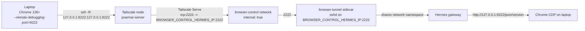

# Remote Browser Control

Optional Compose overlay that lets a laptop expose its local Chrome DevTools
Protocol (CDP) endpoint to the Josemar Hermes gateway over a reverse SSH
tunnel, so Hermes can drive the laptop's Chrome as a remote browser client.
Disabled by default; enabling it does not change Syncthing, the Obsidian vault,
Tailscale node identity, or any existing service.

> The Desktop app on the laptop is only a **remote client**. The server-side
> gateway opens CDP inside the Hermes container's network namespace; nothing
> is published to the host, the LAN, or the public internet.

## Threat model

- **Goal**: let Hermes reach a single, explicitly authorized Chrome instance on
  the operator's laptop, without exposing CDP to anything else.
- **Trusted principals**: the Josemar operator (laptop) and the Josemar server
  (Hermes + Tailscale node).
- **What is exposed**: a single TCP forward `tcp:2222` on the existing
  Tailscale node, forwarding to the `browser-tunnel` SSH daemon. The SSH daemon
  accepts only public-key auth (`AuthenticationMethods publickey`) and only
  creates a reverse listener at `127.0.0.1:9222` inside the shared Hermes
  namespace.
- **What is NOT exposed**: CDP is never bound to `0.0.0.0`, never published as a
  host port, never served via Tailscale Funnel, and never reachable from the
  LAN or the public internet. The `browser-control` Docker network is
  `internal: true` and carries only Hermes and Tailscale.
- **What the laptop supplies**: a single SSH public key (the operator's). The
  entrypoint prefixes restrictive `authorized_keys` options so a supplied plain
  public key cannot gain a shell, cannot do local/dynamic/stream forwarding,
  cannot forward agents, cannot request a TTY, and can only create the
  intended `127.0.0.1:9222` listener. `MaxSessions 0` denies shell/command/
  subsystem session channels while `ssh -N` remote forwarding remains possible.
- **What the server persists**: an Ed25519 SSH host key in the
  `browser-tunnel-state` volume so the laptop's `known_hosts` entry stays stable
  across redeploys. The authorized keys and Tailscale Serve config live in
  dedicated named volumes (`browser-tunnel-authorized-keys` and
  `tailscale-serve-config`) populated by the deploy workflow; no checkout bind
  mounts are used. No credentials are stored in the host-key volume.
- **Out of scope**: multi-user browser control, browser control without
  Tailscale, exposing CDP to other tailnet hosts, or running Chrome on the
  server. None of these are supported.

## Architecture and data flow



Key points:

- The `browser-tunnel` sidecar uses `network_mode: service:hermes`, so it
  shares Hermes's network namespace. The reverse listener the laptop creates
  (`127.0.0.1:9222`) lives in that shared namespace, so Hermes reaches Chrome
  CDP at `http://127.0.0.1:9222`.
- The SSH daemon binds only to `BROWSER_CONTROL_HERMES_IP` (default
  `172.31.250.2`) on the `browser-control` network — not `josemar-network`,
  not the tailnet, not `0.0.0.0`.
- Tailscale Serve forwards `tcp:2222` on the existing Tailscale node to
  `BROWSER_CONTROL_HERMES_IP:2222` (an explicit IP, not a Docker DNS alias).
  No Funnel, no host port publication.
- `config/hermes-config.yaml` sets `browser.cdp_url: "http://127.0.0.1:9222"`.
  No Playwright/Chrome install, no Hermes source patch. The repo-owned
  `browser-control` skill is baked into the Hermes image (see
  "Repo-owned browser-control skill" below), so it is always registered and
  can guide first-time setup and self-diagnose when the overlay is disabled.
- SSH user (`tunnel`), SSH port (`2222`), and CDP port (`9222`) are fixed
  constants and not configurable.

## True optionality (overlay lifecycle)

Browser control lives in a committed overlay file,
`docker-compose.browser-control.yml`, applied **only** when enabled:

- **Disabled (default)**: base `docker-compose.yml` alone. No `browser-control`
  network, no `browser-tunnel` service, no browser-specific Hermes/Tailscale
  network attachments. The base file keeps the always-present
  `tailscale-serve-config` named volume and `TS_SERVE_CONFIG` env so a disabled
  redeploy writes `{}` into `serve.json` and deterministically clears any stale
  `tcp:2222` forward from a previous enabled deploy. The repo-owned
  `browser-control` skill remains registered (it is baked into the image), so
  Josemar can guide the operator through first-time setup and surface
  "overlay disabled" as a likely cause when `browser_*` calls fail.
- **Enabled**: the deploy workflow sets
  `COMPOSE_FILE=docker-compose.yml:docker-compose.browser-control.yml` and adds
  `browser-control` to `COMPOSE_PROFILES` (preserving `aux-ml` if enabled).
- **Disabling after enabling**: the deploy workflow always tears down with
  base + overlay + `browser-control` profile before applying the selected
  config, so a previously-enabled `browser-tunnel` sidecar and the
  `browser-control` network are removed even when the new deploy is disabling
  the overlay.

## Prerequisites

- The existing Josemar Tailscale node is up and the laptop is a member of the
  same tailnet.
- The operator has a GitHub secret `BROWSER_TUNNEL_AUTHORIZED_KEY` containing
  a single-line SSH public key (see below).
- Chrome 136 or newer on the laptop (CDP `--remote-debugging-port` behavior is
  stable on recent versions).

## Laptop setup

> **Dedicated logins warning**: use a dedicated Chrome profile for this tunnel.
> Do NOT use your normal, day-to-day Chrome profile. A remote automation agent
> with CDP access can read/act on everything in that profile, including
> logged-in sessions. Create a fresh profile used only for Josemar browser
> control.

### One-time prerequisites (all platforms)

1. **Generate an SSH keypair** (macOS / Linux / Windows PowerShell or Git Bash):

   ```bash
   ssh-keygen -t ed25519 -f ~/.ssh/josemar_browser_tunnel -N ""
   ```

   This produces `~/.ssh/josemar_browser_tunnel` (private, keep secret on the
   laptop) and `~/.ssh/josemar_browser_tunnel.pub` (public, upload as the
   GitHub secret).

2. **Add the public key as the `BROWSER_TUNNEL_AUTHORIZED_KEY` secret** in
   GitHub (Settings > Secrets and variables > Actions). It must be a single
   line in OpenSSH format, e.g.:

   ```
   ssh-ed25519 AAAAC3NzaC1lZDI1NTE5AAAAI... your-email@example.com
   ```

3. **Grant the laptop access to tcp:2222 on the server (Tailscale ACL).** In
   the Tailscale admin console (ACLs), allow the laptop to reach the server's
   `tcp:2222`. Use an explicit tag or host alias for both `src` and `dst`;
   broad allow rules (e.g. `src: ["*"]`) defeat the narrowing and are not
   recommended.

   ```json
   {
     "action": "accept",
     "src":    ["tag:laptop"],
     "dst":    ["josemar-server:2222"]
   }
   ```

   Replace `tag:laptop` with your laptop's tag (or a specific user) and
   `josemar-server` with the Tailscale node name set by `TAILSCALE_HOSTNAME`
   (default `josemar-server`). Do not use a wildcard `src`.

4. **Confirm Chrome/Chromium 136+ and the Tailscale client are installed** on
   the laptop. The launcher does not install packages.

### Linux Mint (tested/supported) — repo on-demand launcher

The recommended Linux Mint workflow is the repo-provided on-demand launcher.
Nothing starts at system/login startup; you launch it from the Mint application
menu or a clickable desktop entry, and closing all dedicated Josemar Chrome
windows stops the SSH tunnel.

#### One-time install

From a checkout of this repo on the laptop:

```bash
bash laptop/linux/install-launcher.sh
```

The installer is idempotent and creates only user-level paths:

- `~/.local/bin/josemar-browser-control` (symlink to the repo script)
- `~/.local/share/applications/josemar-browser.desktop` (rendered entry)

It does **not** launch the browser or tunnel, does **not** configure autostart,
and does **not** install any packages or require sudo. It validates the desktop
entry with `desktop-file-validate` only if that tool is already installed.

After install, "Josemar Browser" appears in the Mint application menu. The
desktop entry also exposes a right-click "Stop Josemar Browser" action.

#### Daily use

- **Start**: launch "Josemar Browser" from the Mint menu. The launcher starts
  the dedicated Chrome profile (`~/.josemar-chrome-profile`) with loopback-only
  remote debugging on `127.0.0.1:9222`, waits for the CDP endpoint, then opens
  the reverse SSH tunnel to the server's `browser-tunnel` sidecar.
- **Already running**: if you click the launcher again while it is active, it
  opens/focuses a new dedicated window instead of starting a duplicate
  controller.
- **Stop**: closing all dedicated Josemar Chrome windows automatically stops the
  SSH tunnel (Chrome is launched with `--disable-background-mode` so it does
  not linger after the last dedicated window closes). You can also right-click
  the menu entry and choose "Stop Josemar Browser", or run
  `josemar-browser-control stop` in a terminal.
- **Status**: `josemar-browser-control status` reports controller/chrome/tunnel/
  cdp state without reading page or session contents.

#### What persists across reboot

- The dedicated Chrome profile (`~/.josemar-chrome-profile`) persists.
- The SSH key (`~/.ssh/josemar_browser_tunnel`) and known_hosts
  (`~/.ssh/josemar_browser_tunnel_known_hosts`) persist.
- The launcher install (`~/.local/bin`, `~/.local/share/applications`) persists.
- No session, tunnel, or Chrome process survives a reboot; the launcher is
  strictly on-demand.

#### Troubleshooting

- `josemar-browser-control status` — check controller/chrome/tunnel/cdp state.
- Logs live under `~/.local/state/josemar-browser-control/logs/` (no secrets).
- If the tunnel fails, confirm Tailscale is up (`tailscale status`), the server
  sidecar is running, and the `BROWSER_TUNNEL_AUTHORIZED_KEY` secret matches
  this laptop's public key.
- If Chrome fails to start, confirm a graphical session is active
  (`DISPLAY`/`WAYLAND_DISPLAY`) and Chrome 136+ is installed.

#### Uninstall

```bash
bash laptop/linux/install-launcher.sh --uninstall
```

Removes only the files the installer owns (the launcher symlink and desktop
entry). It does **not** delete the Chrome profile, SSH key, known_hosts, or
any credentials.

### Manual commands (diagnostic/fallback)

The launcher wraps the following manual commands. Use them only for
diagnostics or on platforms without the launcher. The normal Chrome profile is
**not supported**; always pass a dedicated `--user-data-dir`.

```bash
# Start Chrome with the dedicated profile and loopback-only CDP.
google-chrome \
  --user-data-dir="$HOME/.josemar-chrome-profile" \
  --remote-debugging-port=9222 \
  --remote-debugging-address=127.0.0.1

# Verify CDP is up locally (do not parse page contents).
curl -s http://127.0.0.1:9222/json/version

# Open the reverse SSH tunnel.
ssh -N \
  -i ~/.ssh/josemar_browser_tunnel \
  -o IdentitiesOnly=yes \
  -o StrictHostKeyChecking=accept-new \
  -o UserKnownHostsFile=~/.ssh/josemar_browser_tunnel_known_hosts \
  -o ServerAliveInterval=30 \
  -o ServerAliveCountMax=3 \
  -o ExitOnForwardFailure=yes \
  -R 127.0.0.1:9222:127.0.0.1:9222 \
  -p 2222 tunnel@josemar-server
```

`ExitOnForwardFailure=yes` makes ssh exit if the reverse listener could not be
created (e.g. another laptop already has the tunnel open). The laptop's
`127.0.0.1:9222` is forwarded to `127.0.0.1:9222` inside the Hermes namespace.

### macOS (untested, best-effort)

> The following is an **untested architectural suggestion**, not a shipped or
> supported implementation. It requires native macOS testing and is not
> authoritative.

No macOS launcher is shipped. To adapt the Linux lifecycle script:

- Copy `laptop/linux/josemar-browser-control` and adjust the Chrome binary path
  to `/Applications/Google Chrome.app/Contents/MacOS/Google Chrome`.
- Replace `/proc/<pid>/cmdline` PID verification with `ps -p <pid> -o command=`
  (macOS has no `/proc`).
- Use a wrapper `.app` (Automator "Application") or a Shortcuts shortcut to
  make it clickable from Finder/Launchpad, with `Terminal=false`-equivalent
  behavior.
- Use `launchd` (e.g. a `~/Library/LaunchAgents` plist) **only if you want
  automatic reconnect/startup behavior**. The user requirement for this repo is
  on-demand only; do not enable `RunAtLoad` unless you explicitly want
  auto-start.

These are architectural suggestions only. They are not tested here and are not
claimed to work.

### Windows (untested, best-effort)

> The following is an **untested architectural suggestion**, not a shipped or
> supported implementation. It requires native Windows testing and is not
> authoritative.

No Windows launcher is shipped. To adapt the lifecycle:

- Write a PowerShell lifecycle script mirroring `josemar-browser-control`
  (`start`/`stop`/`status`), using explicit Chrome and OpenSSH paths, e.g.
  `C:\Program Files\Google\Chrome\Application\chrome.exe` and the Windows
  OpenSSH client.
- Track the dedicated Chrome process and SSH master by PID; verify command
  lines before signaling (do not `Stop-Process` generic Chrome/SSH).
- Create a `.lnk` shortcut for clickable launch from the Start menu/desktop.
- Use Task Scheduler **only if you want automatic reconnect/startup behavior**.
  The user requirement for this repo is on-demand only; do not configure
  logon-triggered tasks unless you explicitly want auto-start.

These are architectural suggestions only. They are not tested here and are not
claimed to work.

## Enablement (GitHub variables)

Set these GitHub repository variables (Settings > Secrets and variables >
Actions > Variables):

| Variable | Default | Notes |
| --- | --- | --- |
| `BROWSER_CONTROL_ENABLED` | `false` | Set to `true` to enable. |
| `BROWSER_CONTROL_SUBNET` | `172.31.250.0/29` | Override only on collision. |
| `BROWSER_CONTROL_GATEWAY` | `172.31.250.1` | Override together with subnet. |
| `BROWSER_CONTROL_HERMES_IP` | `172.31.250.2` | SSH daemon bind IP; Tailscale Serve forwards here. |
| `BROWSER_CONTROL_TAILSCALE_IP` | `172.31.250.3` | Tailscale's IP on browser-control. |

SSH user (`tunnel`), SSH port (`2222`), and CDP port (`9222`) are fixed
constants and not configurable.

And the secret:

| Secret | Notes |
| --- | --- |
| `BROWSER_TUNNEL_AUTHORIZED_KEY` | Single-line SSH public key. Required when enabled. |

Run the deploy workflow. It will:

- Populate the `tailscale-serve-config` named volume with
  `{"TCP":{"2222":{"TCPForward":"<BROWSER_CONTROL_HERMES_IP>:2222"}}}` when
  enabled, or `{}` when disabled (so stale tcp:2222 is cleared).
- Populate the `browser-tunnel-authorized-keys` named volume with the
  operator's public key when enabled, or clear it when disabled.
- Set `COMPOSE_FILE=docker-compose.yml:docker-compose.browser-control.yml`
  and add `browser-control` to `COMPOSE_PROFILES` when enabled; base Compose
  only when disabled.
- Always tear down with base + overlay + profile first, so a previously-enabled
  overlay is removed when disabling.
- Verify the `browser-tunnel` sidecar is running and Tailscale Serve tcp:2222
  targets the exact Hermes IP with no Funnel (it does not require the
  laptop/Chrome to be online).
- Never delete the persistent named volumes during cleanup.

## Verification

On the server:

```bash
# Sidecar is running (only when enabled)
docker compose ps browser-tunnel

# Tailscale Serve is forwarding tcp:2222 to the exact Hermes IP
docker compose exec -T tailscale tailscale serve status --json | grep 2222
```

From the laptop, after opening the reverse tunnel:

```bash
# CDP reachable through the tunnel (run on the laptop)
curl -s http://127.0.0.1:9222/json/version
```

Inside Hermes (server-side), CDP is reachable at the configured URL:

```bash
docker compose exec -T hermes curl -s http://127.0.0.1:9222/json/version
```

This only works while the laptop's reverse tunnel is up.

## Recovery and restarts

- The `browser-tunnel` sidecar has `restart: unless-stopped`. If it restarts,
  the persistent Ed25519 host key in `browser-tunnel-state` is reused, so the
  laptop's `known_hosts` entry stays valid.
- If the laptop's tunnel drops (e.g. after a server redeploy), re-launch
  "Josemar Browser" from the menu, or run `josemar-browser-control start`. The
  launcher is on-demand by design; it does not auto-reconnect. Only one laptop
  can hold the `127.0.0.1:9222` listener at a time; a second connection fails
  fast with `ExitOnForwardFailure=yes`.
- If Tailscale Serve does not pick up the config, restart the tailscale
  container: `docker compose restart tailscale`.
- A disabled redeploy writes `{}` into `tailscale-serve-config`, so a stale
  tcp:2222 forward is removed on the next tailscale restart/redeploy.

## Disable / rollback

1. Set `BROWSER_CONTROL_ENABLED=false` (or unset it) and re-run deploy.
2. The workflow writes `{}` into `tailscale-serve-config`, clears
   `browser-tunnel-authorized-keys`, uses base Compose only, and tears down
   any previous overlay service/network.
3. Stop the laptop's `ssh -R` supervisor unit and close the dedicated Chrome
   profile.
4. Optionally remove the `browser-tunnel-state` volume:
   `docker volume rm <project>_browser-tunnel-state`. The
   `tailscale-serve-config` and `browser-tunnel-authorized-keys` volumes are
   kept so a future re-enable does not require re-populating them.

The Syncthing/vault topology is unchanged by enablement or disablement.

## Subnet collision override

If `172.31.250.0/29` collides with an existing network on the host, pick a free
`/29` (or larger) and set all four together as GitHub variables:

- `BROWSER_CONTROL_SUBNET` (e.g. `172.31.251.0/29`)
- `BROWSER_CONTROL_GATEWAY` (e.g. `172.31.251.1`)
- `BROWSER_CONTROL_HERMES_IP` (e.g. `172.31.251.2`)
- `BROWSER_CONTROL_TAILSCALE_IP` (e.g. `172.31.251.3`)

The deploy workflow validates with `ipaddress` (Python stdlib) that the subnet
is a valid strict IPv4 network and that the gateway, Hermes, and Tailscale IPs
are inside the subnet, usable (not network/broadcast), and unique. The SSH
daemon binds only to `BROWSER_CONTROL_HERMES_IP`, so the laptop's `known_hosts`
does not change (it pins the Tailscale node name, not the browser-control IP).

## What does NOT change

- Syncthing keeps `network_mode: service:tailscale`, its state volume, its GUI
  port, and all current vault behavior.
- The Tailscale node identity (`tailscale-state` volume, `TAILSCALE_HOSTNAME`)
  is unchanged.
- The `obsidian-vault` volume, rclone backup, and gbrain vault interface are
  untouched.
- No new Hermes source patch, no Playwright/Chrome install on the server.

## Repo-owned browser-control skill

The repo-owned `skills-factory/browser-control/SKILL.md` is an instruction-only
skill (a SKILL.md with no executable binary) that teaches the assistant how to
use the `browser_*` tools against the externally connected browser and what the
safety boundaries are. Unlike `gbrain`, `aux-ml`, and `workspace-sync`, it
carries a companion `SETUP.md` with the first-time setup walkthrough (SSH
keypair, server-side overlay enablement, laptop launcher install, Tailscale
ACL). The skill is **baked into the Hermes image** via
`COPY skills-factory/browser-control /opt/josemar/skills/browser-control` in
`Dockerfile.hermes`, so it is always registered regardless of whether the
browser-control overlay is enabled. This lets Josemar guide the operator
through first-time setup and self-diagnose when `browser_*` calls fail (the
skill surfaces both "overlay disabled" and "laptop client offline" as
possible causes and points to `SETUP.md`).

The overlay no longer bind-mounts the skill directory. The overlay only adds
the `browser-control` network attachment and the `browser-tunnel` sidecar; the
skill itself is always present from the image. This does not remove Hermes's
built-in browser tool schemas; the skill is guidance for driving the
externally connected browser, not the tool registration mechanism. The skill
has no executable binary; the actual integration point is Hermes's
`browser.cdp_url` config in `config/hermes-config.yaml`.

Closing the external browser on the operator side makes the CDP endpoint
unreachable, so subsequent `browser_*` calls fail. Reopening the external
browser restores the endpoint, and later `browser_*` calls reconnect without
restarting Hermes.

## Warnings

- Never expose CDP directly to `0.0.0.0`, the LAN, or Tailscale Funnel. The
  only supported path is the reverse SSH tunnel described here.
- The normal Chrome profile is not supported. Always use a dedicated
  `--user-data-dir`.
- Only one laptop can hold the reverse listener at a time.
- The `browser-control` network is `internal: true`; do not change that
  without a reviewed design change.
- Do not use broad Tailscale ACL `src` rules (e.g. `["*"]`); use an explicit
  tag or user for the laptop.