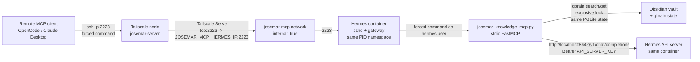

# Josemar Knowledge MCP

Optional Compose overlay that exposes a curated MCP server to a remote client
over a forced SSH command, privately via Tailscale Serve TCP. Disabled by
default; enabling it does not change Syncthing, the Obsidian vault, Tailscale
node identity, or any existing service.

The server offers two distinct classes of tools: **curated read-only gbrain
tools** (vault_search, vault_get, project_context — no vault write access),
and **`josemar_chat`** — a full trusted/user-equivalent capability that
calls the local Hermes API and can trigger Hermes tools and incur model
cost. The MCP server as a whole is **not** read-only; only the three gbrain
tools are.

> The remote MCP client is **user-equivalent** for `josemar_chat` only. The
> vault tools are read-only. No shell, arbitrary command, port forwarding,
> or direct API exposure is available to the remote client.

## Threat model

- **Goal**: let a single, explicitly authorized remote MCP client call a
  curated set of Josemar tools — read-only vault search/get, allowlisted
  project-context reads, and a full trusted/user-equivalent `josemar_chat`
  that hits the local Hermes API — without exposing a shell, arbitrary
  commands, port forwarding, or the raw Hermes API to the client.
- **Trusted principals**: the Josemar operator (remote client) and the Josemar
  server (Hermes + Tailscale node).
- **What is exposed**: a single TCP forward `tcp:2223` on the existing
  Tailscale node, forwarding to a hardened sshd running **inside the Hermes
  container**. The sshd accepts only public-key auth
  (`AuthenticationMethods publickey`) and only runs the forced command
  `/usr/local/bin/josemar-knowledge-mcp-forced`, which execs the repo-owned
  `scripts/josemar_knowledge_mcp.py` stdio FastMCP server as the `hermes`
  user.
- **What is NOT exposed**: no shell (`MaxSessions 1`, `PermitTTY no`,
  `AllowTcpForwarding no`, per-key `no-port-forwarding`), no arbitrary
  commands (forced command is the only path), no port forwarding
  (`AllowTcpForwarding no` globally + per-key), no SFTP/subsystems
  (`Subsystem none`), no direct Hermes API (the client never sees
  `API_SERVER_KEY`; the server injects it server-side). The `josemar-mcp`
  Docker network is `internal: true` and carries only Hermes and Tailscale.
  No Funnel is ever used. No host ports are published.
- **What the client supplies**: a single SSH public key (the operator's). The
  init script prefixes restrictive `authorized_keys` options so a supplied
  plain public key cannot gain a shell, cannot do any forwarding, cannot
  forward agents, cannot request a TTY, and can only run the forced MCP
  command.
- **What the server persists**: an Ed25519 SSH host key in the dedicated
  root-owned `josemar-mcp-hostkeys` named volume mounted at
  `/var/lib/josemar-mcp-hostkeys/` so the client's `known_hosts` entry
  stays stable across redeploys. The authorized keys and Tailscale Serve
  config live in dedicated named volumes (`josemar-mcp-authorized-keys` and
  `tailscale-serve-config`) populated by the deploy workflow; no checkout
  bind mounts are used. No credentials are stored in the host-key path.
- **Out of scope**: multi-client MCP, MCP without Tailscale, exposing the SSH
  endpoint to other tailnet hosts without an explicit ACL, or exposing it via
  Funnel. None of these are supported.

## Architecture and data flow

Key points:

- The hardened sshd runs **inside the existing Hermes container**, started by
  the s6-overlay cont-init script `/etc/cont-init.d/02-josemar-mcp-sshd`
  (installed by `Dockerfile.hermes`). It shares Hermes's PID namespace,
  gbrain PGLite state, advisory locks, and volumes. The forced command runs
  as the `hermes` user (the same non-root user that runs the gateway),
  ensuring correct lock/PGLite access. No separate sidecar container is
  used.
- The sshd starts as root (cont-init scripts run as root) for privilege
  separation, then drops to the `hermes` user for forced commands. The
  Hermes gateway continues to run as non-root `hermes` via
  `s6-setuidgid` in `main-wrapper.sh`. The two processes (sshd and gateway)
  coexist in the same container with different UIDs.
- The SSH daemon binds only to `JOSEMAR_MCP_HERMES_IP` (default
  `172.31.251.2`) on the `josemar-mcp` network — not `josemar-network`, not
  the tailnet, not `0.0.0.0`.
- Tailscale Serve forwards `tcp:2223` on the existing Tailscale node to
  `JOSEMAR_MCP_HERMES_IP:2223` (an explicit IP, not a Docker DNS alias). No
  Funnel, no host port publication.
- The `josemar-mcp` network uses a distinct subnet
  (`172.31.251.0/29`) from `browser-control` (`172.31.250.0/29`) so both
  overlays can be enabled simultaneously. When both are enabled, the deploy
  workflow writes a Tailscale Serve config that maps both `tcp:2222` and
  `tcp:2223`.
- SSH user (`hermes`), SSH port (`2223`), and the forced command are fixed
  constants and not configurable. The `hermes` user has a valid login shell
  so sshd can exec the forced command; `PermitTTY no` and the per-key
  `no-pty` option prevent interactive shells, and the forced command in
  `authorized_keys` overrides any client-requested command.
- `josemar_chat` calls the Hermes API at `http://localhost:8642` (same
  container, loopback) — not over the Docker network — because the MCP
  server runs inside the Hermes container.

## True optionality (overlay lifecycle)

Josemar MCP lives in a committed overlay file,
`docker-compose.josemar-mcp.yml`, applied **only** when enabled:

- **Disabled (default)**: base `docker-compose.yml` alone (plus any other
  enabled overlays). No `josemar-mcp` network, no `josemar-mcp-authorized-keys`
  volume, no josemar-mcp-specific Hermes/Tailscale network attachments. The
  cont-init script `02-josemar-mcp-sshd` checks `JOSEMAR_MCP_ENABLED` and
  skips sshd startup when it is not `true`. The base file keeps the
  always-present `tailscale-serve-config` named volume and `TS_SERVE_CONFIG`
  env so a disabled redeploy writes a Serve config without `tcp:2223` (or
  `{}` if browser-control is also disabled) and deterministically clears
  any stale `tcp:2223` forward from a previous enabled deploy.
- **Enabled**: the deploy workflow sets
  `COMPOSE_FILE=docker-compose.yml:docker-compose.josemar-mcp.yml` (plus any
  other enabled overlays, in fixed order: base; browser-control;
  josemar-mcp; embeddings; mnemosyne; backup last). It populates the
  `josemar-mcp-authorized-keys` named volume with the operator's public key
  and writes the combined Tailscale Serve config. The overlay adds the
  `josemar-mcp` network to hermes and tailscale, mounts the authorized-keys
  volume into hermes, and sets `JOSEMAR_MCP_ENABLED=true` +
  `JOSEMAR_MCP_HERMES_IP` in the hermes env. The cont-init script starts
  the sshd. Deploy verifies the sshd process is running inside hermes, the
  gateway is still non-root, Tailscale Serve `tcp:2223` targets the exact
  Hermes IP with no Funnel, and the forced-command wrapper + MCP server are
  present and import cleanly.

## MCP server

The server is `scripts/josemar_knowledge_mcp.py`, a Python stdio FastMCP
server baked into the Hermes image (see `Dockerfile.hermes`). It is launched
by the forced-command wrapper `/usr/local/bin/josemar-knowledge-mcp-forced`,
which sets the deployment env (`GBRAIN_HOME`, `GBRAIN_BRAIN_REPO`,
`GBRAIN_SCHEMA_PACK`, `GBRAIN_SKIP_STARTUP_HOOKS=1`) and execs the server
with the Hermes venv python. `API_SERVER_KEY` is already in the Hermes
container env (no separate injection needed — the MCP server runs inside
the same container).

### Tools

The server offers two distinct classes of tools:

**Curated read-only gbrain tools** (no vault write access):

- `vault_search(query, max_results=10)` — bounded `gbrain search`. Returns
  metadata snippets (slug, title, type, score, snippet); never full content.
  `max_results` capped at 50.
- `vault_get(path)` — bounded `gbrain get`. Returns title, type, tags,
  frontmatter, compiled content. Path traversal and absolute paths rejected.
- `project_context()` — allowlisted gbrain reads of project-context/memory
  notes only. The allowlist is fixed in the server source; no write access.

**`josemar_chat(prompt, max_tokens=2048)`** — a **full
trusted/user-equivalent capability**, not a read-only tool. Bounded POST
to `http://localhost:8642/v1/chat/completions` using `API_SERVER_KEY` from
the container env. The key is never sent to the client or logged. This tool
can trigger Hermes tools (which may read/write the vault, send messages,
run skills, etc.) and incurs model cost on every call. It is the remote
equivalent of talking to Josemar directly.

See `skills-factory/josemar-mcp/references/tools.md` for the full tool
schemas, bounds, and validation rules.

### gbrain coordination

`vault_search`, `vault_get`, and `project_context` invoke `gbrain` directly
with the deployment env, allowlisted to `search` and `get` only. They acquire
an *exclusive* (`LOCK_EX`) advisory lock on `/opt/data/.locks/tasknotes.lock`
around the gbrain subprocess, with a bounded wait (default 10s). gbrain's
PGLite has its own internal locking, but the remote side must serialize its
own gbrain invocations so they do not race with each other or with
Hermes-side writers (tasknotes mutations, the refresh cron, embed-backfill).
The lock file is shared with those writers (which also take an exclusive
lock). **Fail-closed:** if the lock cannot be acquired within the timeout,
the tool raises a generic `ToolError` ("vault busy: lock timed out") and does
NOT perform the read without the lock. The lock is held only for the duration
of the gbrain subprocess, not around validation or result normalization.

Because the MCP server runs inside the Hermes container as the `hermes`
user, it shares the exact same PGLite state, lock file, and UID as the
gateway and all Hermes-side writers. There is no cross-container mount or
PID-namespace mismatch.

### josemar_chat auth

`josemar_chat` reads `API_SERVER_KEY` from the container env (already
present because the MCP server runs inside the Hermes container) and sends
it as a `Bearer` token to the internal Hermes API at
`http://localhost:8642`. The local API server's existing default-disabled
behavior is preserved: the deploy workflow rejects
`JOSEMAR_MCP_ENABLED=true` unless `HERMES_API_SERVER_ENABLED=true` and
`HERMES_API_SERVER_KEY` is set. The key never appears in client config,
logs, or responses; HTTP errors are surfaced as generic `ToolError` messages
with only the status code.

## Operations

### Enabling

1. Set `HERMES_API_SERVER_ENABLED=true` and `HERMES_API_SERVER_KEY` (if not
   already set).
2. Set `JOSEMAR_MCP_ENABLED=true`.
3. Set the `JOSEMAR_MCP_AUTHORIZED_KEY` secret to the client's single-line
   SSH public key.
4. Run the deploy workflow.

### Disabling

1. Set `JOSEMAR_MCP_ENABLED=false` (or unset it).
2. Run the deploy workflow. It clears `josemar-mcp-authorized-keys`, writes
   the Tailscale Serve config without `tcp:2223`, and the cont-init script
   skips sshd startup. The deploy verifies `tcp:2223` is absent and no
   josemar-mcp sshd process is running inside hermes.

### Recovery

- **sshd not running inside hermes**: check
  `docker compose logs hermes` for `[josemar-mcp-sshd]` messages. Common
  causes: missing/invalid authorized key, missing `JOSEMAR_MCP_ENABLED=true`
  env, or the cont-init script failed validation.
- **Client cannot connect**: confirm Tailscale is up on both ends, the ACL
  allows the client to reach `tcp:2223`, and the `JOSEMAR_MCP_AUTHORIZED_KEY`
  matches the client's public key.
- **`josemar_chat` returns "chat API key is not configured server-side"**:
  `API_SERVER_KEY` is not in the Hermes container env. Confirm
  `HERMES_API_SERVER_ENABLED=true` and `HERMES_API_SERVER_KEY` is set in the
  deploy.
- **Stale `tcp:2223` after disable**: the disabled deploy writes a Serve
  config without `tcp:2223`; if it lingers, restart the tailscale container
  (`docker compose restart tailscale`) so it re-reads `serve.json`.
- **Host key changed**: if the dedicated `josemar-mcp-hostkeys` volume was
  removed, the host key
  at `/var/lib/josemar-mcp-hostkeys/ssh_host_ed25519_key` was regenerated. The
  client must update its `known_hosts` (or rerun
  `ssh-keyscan -p 2223 -t ed25519 <host>`).

## Security checklist

- [ ] `JOSEMAR_MCP_ENABLED` is `false` by default.
- [ ] No Funnel is ever used (deploy verifies).
- [ ] SSH endpoint binds only to `JOSEMAR_MCP_HERMES_IP`, not `0.0.0.0`.
- [ ] `josemar-mcp` network is `internal: true`.
- [ ] No host ports published.
- [ ] Forced command is the only path (`MaxSessions 1`, `PermitTTY no`,
      `AllowTcpForwarding no`, per-key `no-port-forwarding`, `Subsystem none`).
- [ ] `API_SERVER_KEY` is in the container env; never in client config/logs.
- [ ] Tailscale ACL uses explicit `src`/`dst`; no wildcard `src`.
- [ ] Client pins the host key (`StrictHostKeyChecking=yes` recommended).
- [ ] Disabled redeploy clears `josemar-mcp-authorized-keys` and `tcp:2223`.
- [ ] Hermes gateway continues as non-root `hermes` (deploy verifies).
- [ ] sshd runs as root for privilege separation, drops to `hermes` for
      forced commands (deploy verifies).

## Required GitHub variables and secrets

| Variable | Required | Purpose |
| --- | --- | --- |
| `JOSEMAR_MCP_ENABLED` | No (default `false`) | Enable the optional `josemar-mcp` overlay. |
| `JOSEMAR_MCP_SUBNET` | No | Override the internal `josemar-mcp` Docker subnet (default `172.31.251.0/29`). Set together with the gateway/IP overrides if the default collides. |
| `JOSEMAR_MCP_GATEWAY` | No | Override the `josemar-mcp` gateway IPv4 (default `172.31.251.1`). |
| `JOSEMAR_MCP_HERMES_IP` | No | Override Hermes's static IPv4 on `josemar-mcp` (default `172.31.251.2`); the sshd binds only to this IP and Tailscale Serve forwards to it. |
| `JOSEMAR_MCP_TAILSCALE_IP` | No | Override Tailscale's static IPv4 on `josemar-mcp` (default `172.31.251.3`). |
| `HERMES_API_SERVER_ENABLED` | Yes (when `JOSEMAR_MCP_ENABLED=true`) | Must be `true`; `josemar_chat` calls the internal Hermes API. |
| `HERMES_API_SERVER_KEY` | Yes (when `JOSEMAR_MCP_ENABLED=true`) | Bearer token used server-side by `josemar_chat`. |

| Secret | Required | Purpose |
| --- | --- | --- |
| `JOSEMAR_MCP_AUTHORIZED_KEY` | Yes (when `JOSEMAR_MCP_ENABLED=true`) | Single-line SSH public key for the forced-command sshd. |

Security note: keep `JOSEMAR_MCP_HERMES_IP` on the internal `josemar-mcp`
network only. Do not set `HERMES_API_SERVER_BIND_IP=0.0.0.0` unless
`HERMES_API_SERVER_KEY` is set and the network path is trusted. The
`josemar_chat` tool calls the API on loopback
(`http://localhost:8642`) inside the container, not the host bind.
